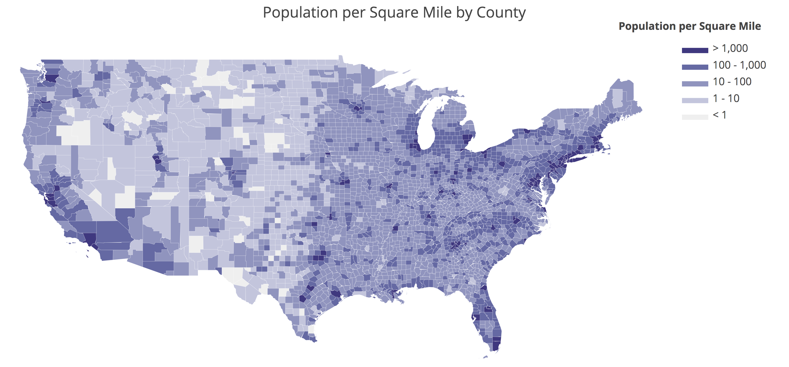
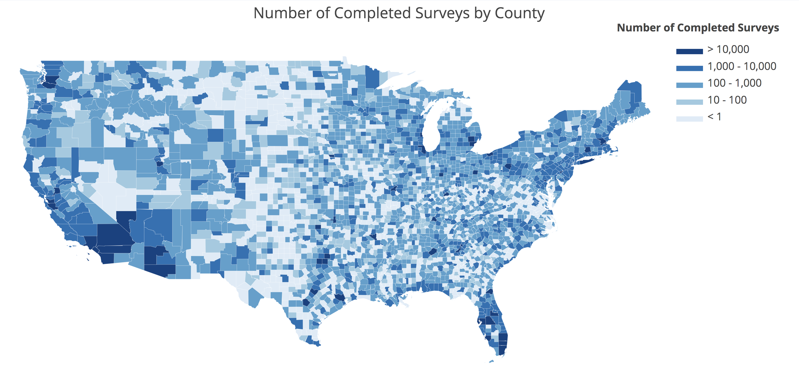
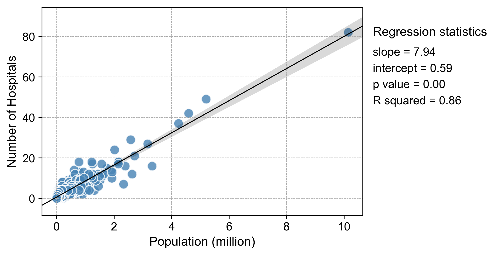
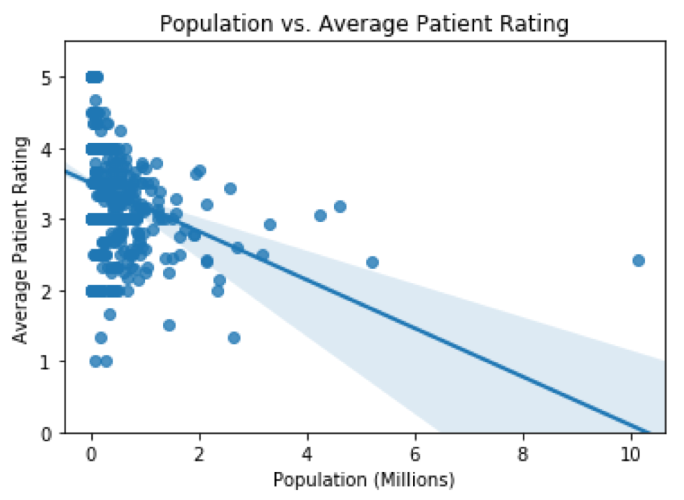
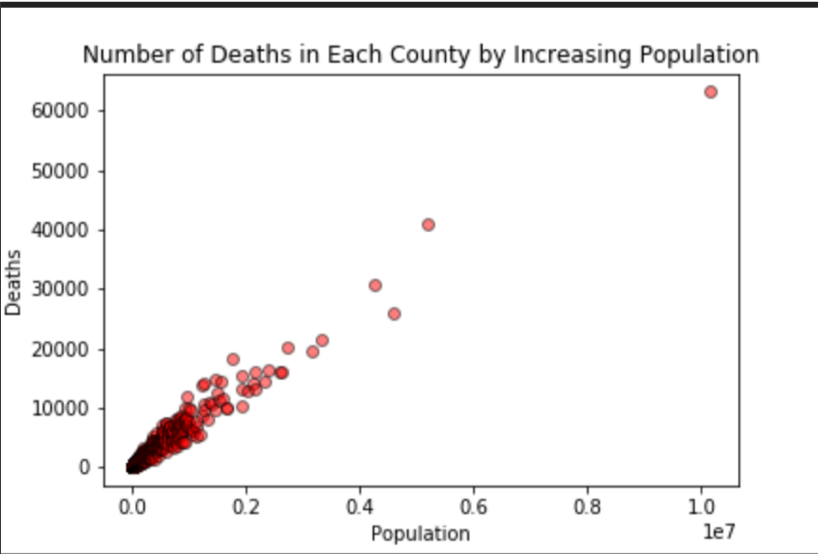

# Healthcare Project - Insights from Patient Experience Rating

## 1. Project Summary

[Presentation slides](Presentation/presentation_final.pptx)

## 2. Visualizations

### 2.1. Maps

### 2.2. Trends and Statistics

#### Number of hospitals vs population

#### Average patient rating vs population

#### Mortality vs population

#### Number of hospitals vs mortality rate

## Conclusions

1. Is there a direct relationship between Number of Hospitals and Population Size?

  - The survey data are more reliable (larger sample size) for places with larger population.
  - The number of hospital increases with population size.

2. Does Number of Hospitals serving the population affect Hospital Patient Experience?

  - As population increased, patient experience ratings decreased.
  - As the total of completed surveys increased, patient experience ratings decreased; and as average completed surveys increased, patient experience ratings decreased.

3. Does Number of Hospitals serving the population affect Mortality Rate?

  - As population increases, deaths increase.
  - As Hospital per Capita (# of hospitals per population) and Number of Hospitals in a County increased, Mortality Rates (Crude Rate & Age Adjusted Rate) decreased. 
  - Further investigation is needed, for example, on hospitals by bed size to understand if overcapacity is a factor.
