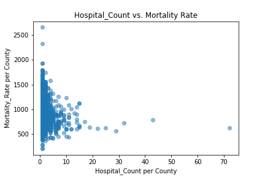

# Healthcare Project - Insights from Patient Experience Rating

## 1. Project Summary

[Project Summary](Project Summary.docx)

## 2. Visualizations

### 2.1. Maps

### 2.2. Trends and Statistics

#### Number of hospitals vs population

#### Number of hospitals vs mortality rate

## Conclusions

- conclusion 1
- conclusion 2